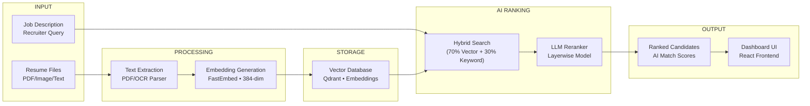

# 🚀 RARE: Resume Analysis & Ranking Engine

### *AI-Powered Semantic Screening & Intelligent Candidate Reranking Platform*

---

## 📖 Overview

**RARE (Resume Analysis & Ranking Engine)** is an advanced, production-grade recruitment intelligence platform built to eliminate the pitfalls of traditional Applicant Tracking Systems (ATS).

Legacy systems rely heavily on rigid, exact keyword matching, frequently missing high-potential candidates who use alternative phrasing. **RARE solves this by introducing deep semantic context.** By leveraging dense vector representations, hybrid sparse-dense retrieval strategies, and an isolated multi-layer LLM reranking layer, RARE interprets the true intent, experience depth, and skills of a candidate relative to a job description.

---

## 🏗 System Architecture



**Data Flow:**
1. `services/resume_embedding/` processes resumes into 384-dim embeddings
2. `services/storage/` stores embeddings in Qdrant and handles hybrid search
3. `services/ranking/` reranks candidates using LLM layerwise evaluation
4. `frontend/` displays results in a modern React dashboard

---

## 📂 Project Structure

```
RARE/
├── frontend/                    # React + TypeScript + Vite UI
│   ├── src/
│   ├── public/
│   ├── package.json
│   └── README.md
│
├── services/
│   ├── resume_embedding/         # Resume → embeddings pipeline
│   │   ├── resume_embedding/     # Core package
│   │   ├── configs/
│   │   ├── data/
│   │   ├── scripts/
│   │   └── requirements.txt
│   │
│   ├── storage/                 # Qdrant storage + retrieval
│   │   ├── config.py
│   │   ├── qdrant_setup.py
│   │   ├── retrieval.py
│   │   └── app.py
│   │
│   └── ranking/                 # LLM reranking engine
│       ├── layerwise_engine.py
│       └── schemas.py
│
├── tests/
│   ├── test_storage.py
│   └── ranking/                 # Ranking tests
│
├── docs/
│   └── architecture.md          # Storage/retrieval architecture
│
├── requirements.txt             # Shared Python dependencies
└── README.md
```

---

## 🛠 Tech Stack

| Component | Technology |
|-----------|------------|
| **Frontend** | React 19, TypeScript, Vite, Tailwind CSS |
| **Backend** | Python 3.11+, Flask, Qdrant |
| **Embeddings** | FastEmbed (BAAI/bge-small-en-v1.5) |
| **Vector DB** | Qdrant |
| **Reranking** | Layerwise LLM Engine |

---

## 📦 Setup

### 1. Clone and Install Python Dependencies

```bash
git clone https://github.com/<your-username>/RARE-ResumeAnalysisRankingEngine.git
cd RARE-ResumeAnalysisRankingEngine

python -m venv .venv
source .venv/bin/activate  # or .venv\Scripts\activate on Windows

pip install -r requirements.txt
pip install -e "./services/resume_embedding[dev]"
```

### 2. Start Qdrant (Vector DB)

```bash
docker run -p 6333:6333 qdrant/qdrant
```

### 3. Install Frontend Dependencies

```bash
cd frontend
npm install
```

---

## ▶ Running the Services

### Python Services (Mock Mode)

Run the end-to-end pipeline demonstration:

```bash
# From repository root
python main.py
```

Or with custom parameters:

```bash
python pipeline_integration.py
python pipeline_optimized.py
```

### Frontend Development

```bash
cd frontend
npm run dev
```

---

## 📊 API Endpoints (Storage Service)

| Method | Endpoint | Description |
|--------|----------|-------------|
| `POST` | `/search` | Search candidates (hybrid/vector/keyword) |
| `POST` | `/ingest` | Ingest a new candidate resume |
| `GET` | `/resume/<id>` | Get candidate by ID |
| `GET` | `/health` | Health check |

---

## 📄 License

MIT License — see individual service LICENSE files for details.